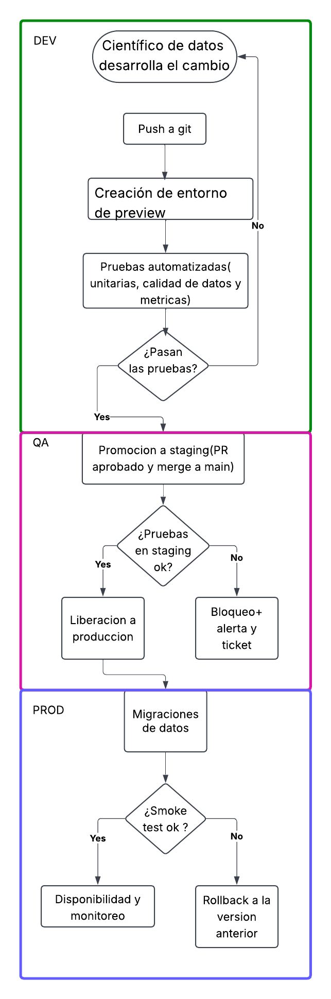
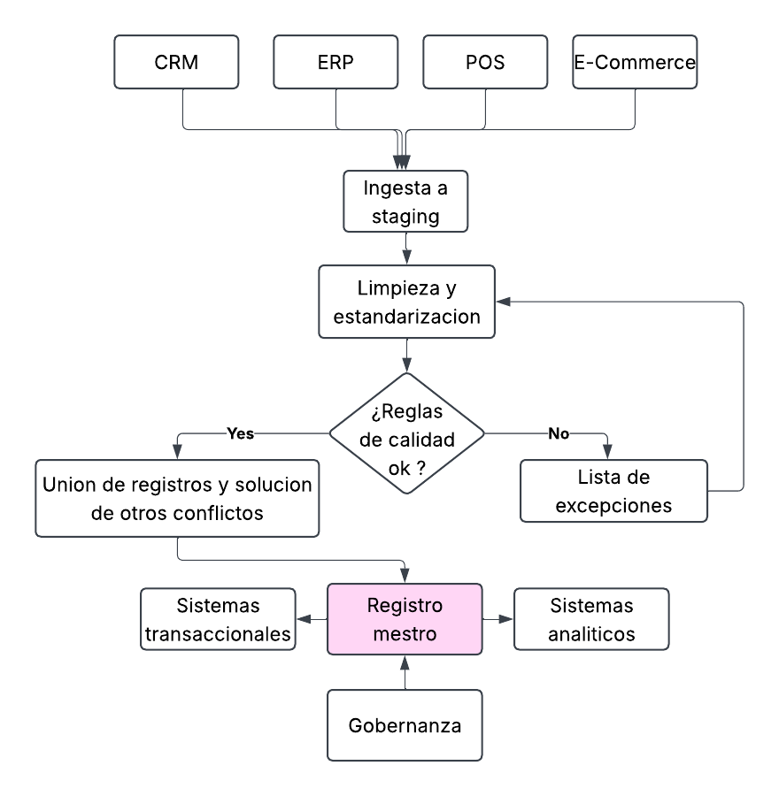
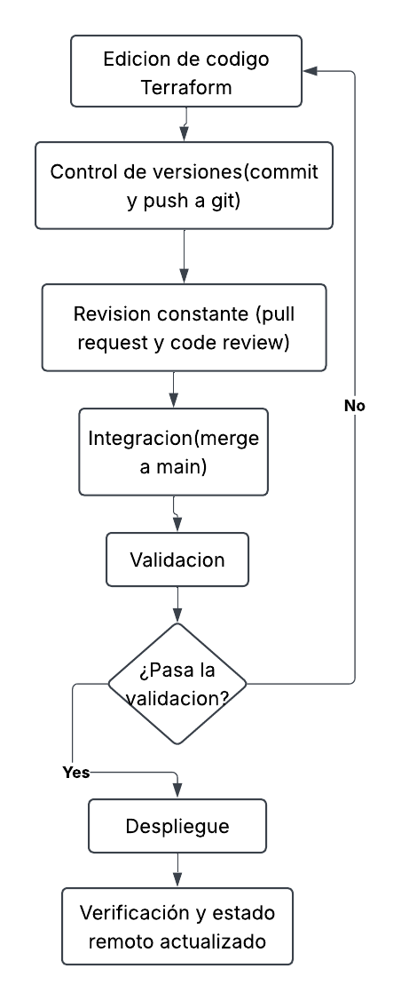
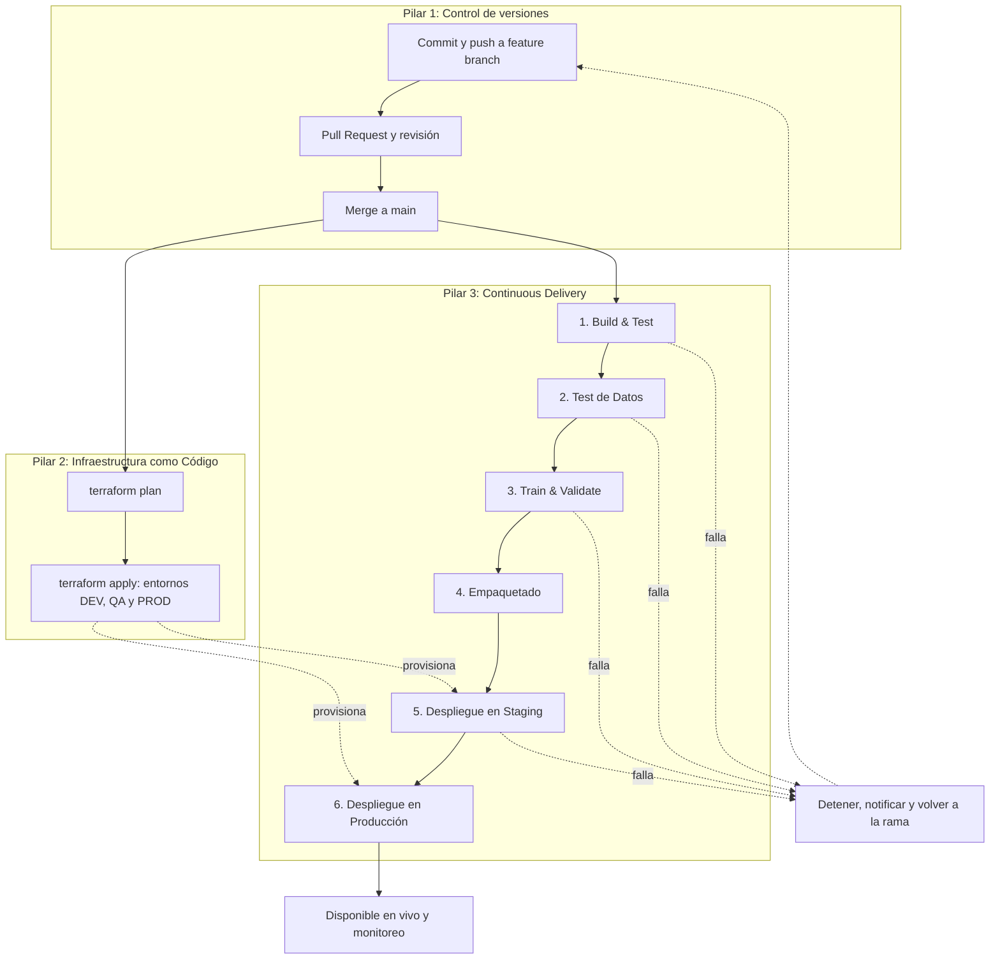

# DataCorp Analytics - Taller DataOps - Michelle Ruiz

Repositorio de la parte práctica del taller donde desarrollamos el diseño de entornos aislados, gestión de datos maestros (MDM) y estrategias de control y replicabilidad.

## Actividad 1: Diseño de Entornos Aislados

### 1.1 Estructura de los tres entornos

| Entorno | Propósito | Acceso | Datos | Infraestructura | Control de código |
|---|---|---|---|---|---|
| DEV | Zona de experimentación donde exploramos datos y probamos modelos sin riesgo. | Científicos e ingenieros de datos (lectura/escritura amplia). | Sintéticos o muestra reducida y anonimizada. Nunca datos reales de clientes. | Recursos pequeños y efímeros (EC2 pequeña, bucket S3 de desarrollo, BD local o contenedor). | Ramas feature y commits libres en la rama propia. |
| QA | Validar de extremo a extremo (integración, regresión, rendimiento) antes de llegar a clientes. | Equipo de QA, DataOps y el pipeline CI/CD. Científicos solo lectura de resultados. | Réplica de PROD con PII anonimizada. | Misma arquitectura que PROD a menor escala (bucket S3 y BD de staging). | Solo se llega por Pull Request aprobado y merge a main para despliegue automático. |
| PROD | Servir a los clientes con un estado estable y confiable. | Muy restringido, solo el pipeline de CD y operaciones con roles de mínimo privilegio para que nadie pueda modificar a mano. | Datos reales completos, con cifrado y auditoría. | RDS con alta disponibilidad (Multi-AZ), backups automáticos, monitoreo y alertas. | Inmutable una vez desplegado, ya que permite solo versiones etiquetadas (`v1.2.0`) con aprobación manual. |

**Justificación de las decisiones**

- **DEV** permite libertad porque el costo de un error es cero (sin datos reales ni clientes). Los datos sintéticos evitan fugas de información sensible y cumplen con la Ley 1581 de 2012 de protección de datos personales.

- **QA** debe parecerse a producción para que las pruebas sean confiables. Se anonimizan los datos personales porque más personas acceden a este entorno y el riesgo de fuga es mayor.

- **PROD**: el acceso restringido y el código inmutable garantizan que sea la fuente de la verdad y que todo cambio quede trazable y reversible. Responde directamente a los problemas presentados de DataCorp.

### 1.2 Diagrama de flujo de un cambio en un modelo predictivo



**Si la imagen del flujo no se logra visualizar en este archivo README, revisar en los docs de la entrega del taller practico**

**Explicación de cada etapa**

1. **Push a Git (feature branch):** el cambio se guarda en una rama aislada; así main nunca se contamina y queda trazabilidad.

2. **Creación de entorno de preview:** al abrir el Pull Request, se crea automáticamente un entorno temporal para probar el cambio de forma aislada; se destruye al cerrar el PR.

3. **Pruebas automatizadas:** unit tests (pytest), validación de esquema y nulos, y métricas mínimas del modelo. Si fallan, el cambio vuelve a DEV.

4. **Promoción a staging:** tras el code review y el merge a `main`, el pipeline despliega a QA/Staging, donde se ejecutan pruebas de integración, regresión y rendimiento con datos anonimizados.

5. **Liberación a producción:** con la aprobación manual de un responsable, se etiqueta la versión y el pipeline la despliega. Nunca se hace a mano.

6. **Migraciones de datos:** cambios de esquema o tablas, con backup previo y plan de reversa.

7. **Disponibilidad en vivo:** se ejecutan smoke tests; si pasan, el cambio queda activo para los clientes bajo monitoreo continuo. Si fallan, se hace rollback a la versión anterior.

### 1.3 Simulación: falla de un modelo en QA

**Escenario:** el modelo pasa las pruebas en DEV, pero en QA su MAPE sube de 12 % a 31 % (el umbral máximo permitido es 15 %). La causa es que la columna `fecha_venta` llega en otro formato en QA, lo que rompe las variables de temporada.

**Protocolo de actuación**

*Nota: las soluciones se plantearon a partir de una guía dada por Claude al entregarle este escenario.*

| Paso | Acción | Herramienta |
|---|---|---|
| 1. Detección | El pipeline detecta MAPE > 15 % y marca el job como fallido. | GitHub Actions, MLflow |
| 2. Bloqueo | Las reglas de protección de rama impiden el merge y la promoción a PROD queda bloqueada automáticamente. | GitHub branch protection |
| 3. Notificación | Alerta al equipo con enlace al log, versión y commit responsable. | Slack/Email desde GitHub Actions |
| 4. Diagnóstico | Se revisan logs, se comparan datos DEV vs QA y métricas contra el modelo base. | Logs del pipeline, MLflow |
| 5. Reproducción | Se recrea el fallo en DEV con el mismo commit y datos (replicabilidad). | Git, DVC, IaC |
| 6. Corrección | Se corrige en una rama `fix/formato-fecha` y se agregan pruebas para ese caso. | Git, pytest |
| 7. Nueva validación | El fix recorre de nuevo todo el flujo: PR, preview, pruebas y staging. | CI/CD |
| 8. Registro | Se documenta el incidente y la lección aprendida (post-mortem sin culpables). | Issue de GitHub |

**Validaciones que habrían evitado el problema:** validación de esquema y tipos (Great Expectations), calidad de datos (nulos, rangos, duplicados), umbrales de métricas contra un modelo base, pruebas de regresión contra la versión en PROD y detección de drift.

**Por qué no llega a producción:** la promoción exige que todas las pruebas de staging pasen, además hay aprobación manual antes de PROD y, finalmente, PROD solo acepta versiones etiquetadas desplegadas por el pipeline.

## Actividad 2: Implementación de MDM

### 2.1 Entidades maestras de DataCorp Analytics

| Entidad maestra | Atributos clave | Fuentes de datos | Reglas de calidad | Data owner |
|---|---|---|---|---|
| Cliente | id_cliente_maestro, tipo y número de documento, nombres, correo, teléfono, ciudad, fecha de registro, estado_cliente | CRM, e-commerce, POS de las tiendas, programa de fidelización | Documento único y válido, correo con formato válido, teléfono normalizado (+57), sin duplicados y campos obligatorios completos | Director Comercial |
| Producto | id_producto_maestro, SKU, descripción, categoría, marca, precio de lista, unidad de medida, estado | ERP, catálogo de proveedores, e-commerce | SKU único; categoría dentro de la taxonomía oficial; precio mayor a 0; sin descripciones vacías | Gerente de Categorías |
| Proveedor | id_proveedor_maestro, NIT, razón social, contacto, condiciones de pago, país, estado | ERP, módulo de compras, contratos | NIT único y válido; razón social normalizada y contacto | Director de Compras |
| Ubicación (tienda o sucursal) | id_ubicacion, nombre, tipo (tienda, bodega, online), dirección, ciudad, coordenadas, región, estado | ERP, POS, sistema de logística | Dirección estandarizada, coordenadas válidas, ciudad y región, código único | Director de Operaciones |
| Finanzas | id_centro_costo, cuenta contable, descripción, moneda, responsable, vigencia | ERP financiero, sistema contable | Código único, moneda válida (COP, USD), vigencia coherente (fecha inicio menor que fecha fin), responsable asignado | Director Financiero (CFO) |

### 2.2 Flujo de consolidación hacia el registro maestro



**Si la imagen del flujo no se logra visualizar en este archivo README, revisar en los docs de la entrega del taller practico**

**Explicación de cada componente**

1. **Fuentes transaccionales:** CRM, ERP, POS, e-commerce y archivos de proveedores. Cada una guarda los datos a su manera, con formatos y claves distintas.
2. **Ingesta a zona de staging:** los datos se copian sin modificarlos a una zona de paso, para no afectar a los sistemas de origen.
3. **Limpieza y estandarización:** se corrigen formatos (fechas, teléfonos, direcciones), se eliminan espacios y se unifican catálogos.
4. **Validación de calidad:** se aplican las reglas del punto 2.1. Los registros que no cumplen van a una cola de excepciones que revisa el data steward.
5. **Matching y deduplicación:** se identifican registros que representan a la misma entidad (por ejemplo, el mismo cliente en CRM y POS).
6. **Resolución de conflictos (survivorship):** cuando hay valores distintos para un mismo atributo, se elige el correcto según reglas definidas (fuente más confiable o dato más reciente).
7. **Registro maestro (golden record):** versión única y confiable de cada entidad, con identificador maestro y trazabilidad de su origen. Aquí actúa la gobernanza: los cambios requieren aprobación.
8. **Sincronización hacia sistemas transaccionales:** el registro maestro se publica de vuelta a CRM, ERP y POS para que todos usen los mismos datos.
9. **Sincronización hacia sistemas analíticos:** el registro maestro alimenta el data warehouse, el feature store y los dashboards, de modo que los modelos y reportes se construyen sobre la misma fuente de la verdad.

### 2.3 Políticas de gobernanza del dato maestro "Cliente"

**1. Definición de "cliente activo"**

Cliente que tiene al menos una compra completada (no cancelada ni devuelta) en los últimos 12 meses contados desde la fecha de corte.

| Estado | Criterio |
|---|---|
| Activo | Última compra completada hace 12 meses o menos |
| Inactivo | Última compra hace más de 12 y hasta 24 meses |
| Perdido | Última compra hace más de 24 meses |
| Prospecto | Registrado pero sin compras |

**2. Reglas de limpieza y duplicación**
**Puntuaciones referidas por Claude**

- Nombres: sin espacios dobles, en formato Título; sin caracteres especiales.
- Correo: en minúsculas y con formato válido.
- Teléfono: formato nacional.
- Documento: tipo y número obligatorios; no se admiten ceros ni valores de prueba.
- Duplicados exactos: mismo tipo y número de documento. Se fusionan automáticamente.
- Duplicados probables: coincidencia aproximada de nombre, fecha de nacimiento y correo, con puntuación de similitud:
  - Mayor o igual a 0.95: fusión automática.
  - Entre 0.80 y 0.95: revisión manual del data.
  - Menor a 0.80: revisión manual para confirmar que son registros distintos.
- Todas las fusiones quedan registradas y se pueden revertir.
- Regla de supervivencia: ante conflictos prevalece el dato verificado más reciente de la fuente más confiable.

**3. Flujo de aprobación para cambios**

1. Solicitud de cambio (usuario autorizado o proceso automático).
2. Validación automática de las reglas de calidad.
3. Revisión del data steward de Clientes.
4. Aprobación del data owner (Director Comercial) si el cambio afecta atributos críticos (documento, estado, definición de cliente activo).
5. Publicación en el registro maestro y sincronización a los sistemas.
6. Registro en el log de auditoría (quién, qué, cuándo y por qué).

**4. Políticas de acceso y seguridad**

- Control de acceso por roles y principio de mínimo privilegio.
- Solo el data steward y los procesos autorizados escriben en el maestro; los demás roles tienen lectura.
- Datos personales (PII) anonimizados en DEV y QA.
- Cifrado en reposo y en tránsito.
- Auditoría constante de accesos y cambios.
- Cumplimiento de la Ley 1581 de 2012: autorización del titular, derecho de consulta, rectificación y supresión, y tiempos de retención definidos.

### 2.4 Simulación: conflicto en la definición de "cliente activo"

**Escenario (datos hipotéticos):** dos fuentes manejan definiciones distintas.

| Fuente | Definición de "cliente activo" | Clientes activos reportados |
|---|---|---|
| CRM (área de Marketing) | Inició sesión o abrió un correo en los últimos 90 días | 120.000 |
| ERP/POS (área Comercial) | Realizó al menos una compra en los últimos 12 meses | 85.000 |

**Problema:** el modelo de predicción de abandono se entrenó con la definición del CRM, y el dashboard de ventas usa la del ERP. Los reportes no coinciden, la dirección desconfía de las cifras y nadie puede explicar por qué el modelo da otros resultados.

**Cómo lo resuelve MDM**

1. **Detección:** el proceso de matching evidencia que el mismo atributo tiene reglas distintas en cada fuente.
2. **Decisión de gobernanza:** el comité de gobernanza, con el data owner de Cliente, define una única definición oficial con la compra completada en los últimos 12 meses.
3. **Cálculo centralizado:** el atributo estado_cliente se calcula una sola vez en el registro maestro y se distribuye a todos los sistemas.
4. **Atributos separados:** la definición del CRM no se pierde solo se conserva con otro nombre (usuario_activo_app) para evitar confusiones.
5. **Versionado:** la definición queda documentada como v1.0 con fecha de vigencia en el glosario.

**Impacto en la replicabilidad de modelos**

- Cada modelo registra la versión de la definición con la que se entrenó (por ejemplo, `definicion_cliente_activo=v1.0`)
- Si la definición cambia a v2.0, los modelos antiguos pueden recrearse con v1.0 y compararse con los nuevos.
- Sin MDM no se podría saber con cuál definición se entrenó cada modelo, y los resultados serían imposibles de replicar.

### Para el desarrollo de este punto, nos estuvimos guiando frecuentemente con Claude para la creación de los archivos YAML, pipelines e infraestructura en Terraform ya que es la primera vez trabajando con una simulación de control de versiones 

## Actividad 3: Control de Versiones para Todo

### 3.1 Estructura del repositorio

```text
datacorp-datops/
├── README.md
├── requirements.txt
├── .gitignore
├── .github/
│   ├── pull_request_template.md
│   └── workflows/ci.yml
├── src/
│   ├── features/build_features.py
│   ├── models/train_model.py
│   └── data_quality/validate_data.py
├── notebooks/01_exploracion_ventas.py
├── sql/create_dim_cliente.sql
├── tests/test_build_features.py
├── config/
│   ├── dev.yaml
│   ├── qa.yaml
│   ├── prod.yaml
│   └── model_params.yaml
├── pipelines/
│   ├── Jenkinsfile
│   └── airflow/dags/ventas_forecast_dag.py
├── infrastructure/terraform/
│   ├── main.tf
│   └── variables.tf
├── data/
│   ├── README.md
│   └── raw/ventas_2026-09.csv.dvc   (puntero; el dato real no está en Git)
└── docs/
    ├── img/
    └── procedencia/lineage_ventas.yaml
```

| Carpeta o archivo | Qué contiene | Categoría pedida |
|---|---|---|
| `src/`, `notebooks/`, `sql/`, `tests/` | Scripts Python, notebooks exportados a `.py`, consultas SQL y pruebas | Código |
| `config/` | Parámetros por entorno y del modelo en YAML | Configuraciones |
| `pipelines/` | DAG de Airflow y Jenkinsfile | Definiciones de pipeline |
| `infrastructure/terraform/` | Definición de la infraestructura | Infraestructura como código |
| `data/` y `docs/procedencia/` | Punteros a datos y documentación de su origen | Procedencia de datos |
| `.github/` | Plantilla de Pull Request y flujo de CI | Control y automatización |

Los notebooks se versionan exportados a `.py` (celdas `# %%`) para evitar subir salidas con datos reales y para que los cambios sean legibles en Git.

### 3.2 Qué se versiona, qué no y por qué

**Que si se versiona**

| Elemento | Por qué |
|---|---|
| Código (Python, SQL, notebooks exportados a .py) | Permite saber quién cambió qué y volver a una versión anterior |
| Configuraciones YAML por entorno | Un cambio de configuración puede alterar los resultados tanto como uno de código |
| Definiciones de pipeline (DAGs, Jenkinsfile) | Si el pipeline cambia sin registro, no se puede reproducir un resultado pasado |
| Infraestructura (Terraform) | Permite recrear entornos idénticos |
| Pruebas | Garantizan que el comportamiento esperado se conserve |
| Punteros de datos (`.dvc`) y documentación de procedencia | Indican con qué versión exacta de datos se obtuvo un resultado |
| Definiciones de negocio (por ejemplo, "cliente activo" v1.0) | Un modelo solo es replicable si se sabe con qué definición se entrenó |

**Que no se versiona**

| Elemento | Por qué | Qué se hace en su lugar |
|---|---|---|
| Datos en bruto | Son pesados, cambian con frecuencia y pueden contener PII | Se guardan en almacenamiento (S3) y en Git se versiona un puntero `.dvc` con el hash |
| Modelos entrenados y archivos pesados | Hacen crecer el repositorio sin aportar trazabilidad de cambios | Se registran en un model registry (MLflow) con referencia al commit |
| Secretos y credenciales (`.env`, `*.pem`, `*.tfvars`) | Un secreto subido a Git queda en el historial para siempre | Gestor de secretos (AWS Secrets Manager) |
| Estado de Terraform (`*.tfstate`) | Contiene información sensible | Backend remoto cifrado |
| Archivos temporales y caché (`__pycache__`, `.venv`) | Se regeneran solos | Se excluyen con `.gitignore` |

**Versionado de la procedencia de datos**

La procedencia (lineage) responde: "¿de dónde salió este resultado y cómo se obtuvo?". Para cada conjunto de datos se versiona un archivo (por ejemplo `docs/procedencia/lineage_ventas.yaml`) con:

- Fuente, fecha de extracción y responsable.
- Versión del esquema.
- Transformaciones aplicadas y el commit del código usado.
- Puntero `.dvc` al dato exacto (hash).
- Modelos derivados de ese dato.

Así, cualquier modelo o dashboard se puede recrear: mismo commit de código + mismo puntero de datos + misma configuración + misma definición de negocio.

### 3.3 Simulación de commit y Pull Request

Contexto: se corrige el error del punto 1.3 donde la columna `fecha_venta` llega en formato `dd/mm/yyyy` en QA y rompe las variables de temporada.

Solución: En QA llegaban fechas dd/mm/yyyy y el parseo estricto rompía las variables
de temporada (MAPE de 12 % a 31 %) así que se agregan formatos admitidos y una
prueba de regresión.

Closes #1
**Flujo de revisión de código**

1. Se crea la rama `fix/formato-fecha-venta` desde `main`.
2. Se hace el commit con mensaje descriptivo y se sube la rama.
3. Se abre el Pull Request con la plantilla (qué cambia, por qué, checklist).
4. Se ejecuta automáticamente el CI: instala dependencias y corre las pruebas.
5. Un revisor revisa lógica, pruebas, calidad y que no haya datos ni credenciales; deja comentarios o aprueba.
6. Si hay observaciones, se corrigen con nuevos commits en la misma rama.
7. Con el CI en verde y la aprobación, se hace el merge a `main` y se elimina la rama.

**Integración con QA**

- El PR dispara el entorno de preview con pruebas automatizadas (unitarias, calidad de datos y métricas del modelo).
- El merge a `main` promueve el cambio a staging (QA), donde se ejecutan integración, regresión y rendimiento con datos anonimizados.
- Si QA falla, la promoción a PROD se bloquea y se abre un nuevo ciclo de corrección.
- Si QA pasa, se etiqueta la versión (`vX.Y.Z`) y, con aprobación manual, se libera a producción.

**Para la actividad 4 nuevamente nos estuvimos guiando de explicaciones de Claude para los archivos de infraestructura en Terraform y la creación del nuevo archivo de salidas**

## Actividad 4: Infraestructura como Código (IaC)

### 4.1 Archivo Terraform (simulado)

El código está en [`infrastructure/terraform/`](infrastructure/terraform/): main.tf , variables.tf y outputs.tf.

| Recurso Terraform | Entorno | Qué hace | Decisiones de seguridad |
|---|---|---|---|
| `aws_s3_bucket.staging_data` | QA/Staging | Almacena los datos de staging | Versionado activado, cifrado AES256 y acceso público bloqueado |
| `aws_instance.dev` | DEV | Máquina de trabajo del equipo de datos | IMDSv2 obligatorio y rol con permisos mínimos |
| `aws_db_instance.prod` | PROD | Base de datos de producción (PostgreSQL) | Multi-AZ, cifrada, no pública, backups de 7 días, protección contra borrado y contraseña gestionada por Secrets Manager |
| `aws_iam_role.dev_ec2_role` | DEV | Identidad de la instancia de DEV | Solo puede listar, leer y escribir en el bucket de staging |

Los recursos están conectados entre sí y la política del rol IAM hace referencia al bucket, la instancia usa el rol mediante un perfil. Terraform deduce ese orden por si solo.

### 4.2 Cómo se replican entornos idénticos

Este archivo describe la infraestructura de forma declarativa y permite replicar los entornos porque:

- Es reproducible ya que el mismo código con las mismas variables produce siempre la misma infraestructura, sin configuración manual.
- Es parametrizable porque cambiando variables se crea una copia en otra cuenta o región.
- Está versionado en Git entonces se sabe quién cambió qué y se puede volver a una versión anterior.
- El estado de Terraform compara lo que existe con lo que dice el código y solo aplica las diferencias.
- Un científico de datos nuevo obtiene su entorno de DEV en minutos con un solo comando, en vez de días de instalación manual.

**Comandos para aplicar los cambios**

```bash
terraform init                      # descarga el proveedor y prepara el directorio
terraform fmt -check                # revisa el formato del código
terraform validate                  # valida la sintaxis y la coherencia
terraform plan -out=tfplan          # muestra qué se creará, cambiará o destruirá
terraform apply tfplan              # aplica exactamente el plan aprobado
terraform destroy                   # elimina la infraestructura (solo en entornos no productivos)
```

Para crear una réplica con otro nombre y región:

```bash
terraform plan -var "project=datacorp-qa" -var "region=us-east-2" -out=tfplan
terraform apply tfplan
```

### 4.3 Flujo de trabajo de IaC



1. **Edición de código:** se modifica el Terraform en una rama `feature/infra-*`, nunca directo en `main`.
2. **Control de versiones:** se hace commit y push; el historial registra quién, qué y por qué.
3. **Revisión:** se abre un Pull Request; un revisor verifica seguridad, costos y coherencia con las políticas.
4. **Integración:** con la aprobación se hace merge a `main`, que dispara el pipeline.
5. **Validación de sintaxis:** el pipeline ejecuta `terraform fmt -check`, `terraform validate` y `terraform plan`. Si falla, el cambio vuelve a edición. Estas mismas validaciones corren como chequeo del PR.
6. **Despliegue:** `terraform apply` del plan aprobado. DEV y QA se despliegan automáticamente y PROD requiere aprobación manual.
7. **Verificación:** se comprueba que la infraestructura coincide con el código y se actualiza el estado remoto.


## Actividad 5: Continuous Delivery para DataOps

### 5.1 Pipeline de CD para el modelo de predicción de ventas

El pipeline se dispara con cada merge a `main` y lleva el modelo de predicción de ventas desde el código hasta producción en seis etapas. Una etapa solo corre si la anterior pasó.

| Etapa | Qué hace |
|---|---|
| 1. Build & Test | Instala dependencias, revisa el estilo del código y ejecuta las pruebas unitarias del código |
| 2. Test de Datos | Valida la calidad de los datos de entrada antes de usarlos |
| 3. Train & Validate | Entrena el modelo y valida que su desempeño cumpla los umbrales |
| 4. Empaquetado | Construye el artefacto versionado del modelo (imagen Docker) y lo publica |
| 5. Despliegue en Staging | Despliega en QA y ejecuta pruebas de integración y regresión con datos anonimizados |
| 6. Despliegue en Producción | Libera a clientes de forma gradual, con aprobación manual y monitoreo |


### 5.2 Herramientas, criterios de éxito y acciones en caso de fallo

| Etapa | Herramientas sugeridas | Criterios de éxito | Acción en caso de fallo |
|---|---|---|---|
| 1. Build & Test | GitHub Actions o Jenkins, pytest, flake8 | Instalación sin errores; todas las pruebas pasan, cobertura mayor o igual a 80 % | Se detiene el pipeline, se notifica al autor y el merge queda bloqueado hasta corregir |
| 2. Test de Datos | Great Expectations o Pandera, pandas | Nulos menores o iguales a 10 % por columna, esquema y tipos correctos, fechas en formato válido, sin duplicados en las claves, valores dentro de rangos | Se detiene antes de entrenar, se pone el lote en cuarentena, se alerta al data steward y finalmente se abre un ticket |
| 3. Train & Validate | scikit-learn o XGBoost, MLflow, DVC | MAPE menor o igual a 15 %, resultado reproducible (semilla fija y datos versionados) | El modelo no se registra ni se promueve; se mantiene el modelo de producción y se analizan las causas (datos, variables, parámetros) |
| 4. Empaquetado | Docker, MLflow Model Registry, Trivy | La imagen se construye; versión semántica (`vX.Y.Z`),prueba de arranque del contenedor | No se publica el artefacto; se corrigen dependencias o vulnerabilidades |
| 5. Despliegue en Staging | Terraform, Docker, GitHub Actions | Pruebas de integración y regresión superadas, latencia dentro del límite acordado, resultados coherentes con producción | Rollback automático a la versión anterior de staging y bloqueo de la promoción a PROD |
| 6. Despliegue en Producción | Aprobación manual| Aprobación del responsable, smoke tests correctos, tasa de errores y latencia normales durante la ventana de observación | Rollback automático a la versión anterior, registro del incidente y post-mortem sin culpables |

### 5.3 Simulación de falla en "Test de Datos"

Escenario: el lote `ventas_2026-10` llega con la columna `unidades` con 18 % de valores nulos, por encima del umbral permitido (10 %). Probablemente una de las tiendas dejó de enviar el dato.


**Protocolo de actuación**

| Paso | Acción | Herramienta |
|---|---|---|
| 1. Detección | La validación calcula 18 % de nulos en `unidades` (límite 10 %) y marca la etapa como fallida | Great Expectations, `validate_data.py` |
| 2. Bloqueo | El pipeline se detiene entonces no se ejecutan Train & Validate, empaquetado ni los despliegues | GitHub Actions (`needs`) |
| 3. Cuarentena | El lote se aparta y no se usa para entrenar; el modelo en producción sigue operando | Bucket de cuarentena en S3 |
| 4. Notificación | Alerta con el detalle de la columna y el porcentaje al data steward y al equipo | Slack o correo desde el pipeline |
| 5. Diagnóstico | Se rastrea el origen con la procedencia de datos y se identifica qué fuente falló | `docs/procedencia/`, logs |
| 6. Corrección | Se corrige en la fuente o se aplica una regla de imputación aprobada por gobernanza, y se reprocesa | Equipo de datos, MDM |
| 7. Reintento | El pipeline vuelve a correr desde la etapa 1 con el lote corregido | CI/CD |
| 8. Registro | Se documenta el incidente y se evalúa reforzar las reglas de calidad | Issue de GitHub |

¿Cómo se evita que el modelo llegue a producción?

1. Cada etapa depende de la anterior: si el test de datos falla, las siguientes nunca se ejecutan.
2. No se genera ningún modelo ni artefacto nuevo, así que no hay nada que desplegar.
3. El despliegue a producción exige además aprobación manual y que staging haya pasado.
4. Se evita el principio "Garbage in, garbage out": un modelo entrenado con datos defectuosos produciría predicciones poco confiables.

### 5.4 Pipeline completo con los tres pilares
**Para el flujo del pipeline usamos Claude para el código en mermaid**



**Cómo se integran los tres pilares**

| Pilar | Dónde aparece en el diagrama | Aporte |
|---|---|---|
| Control de versiones | Commit, Pull Request y merge a `main` | Todo cambio queda trazable, revisado y reversible; el merge dispara el pipeline |
| Infraestructura como Código | `terraform plan` y `terraform apply` | Crea entornos idénticos (DEV, QA, PROD) y los usa el despliegue en staging y producción |
| Continuous Delivery | Las seis etapas del pipeline | Automatiza las validaciones y promociones, con puertas de control antes de producción |

Los tres forman una tripleta: sin control de versiones no hay qué automatizar, sin IaC los entornos no son reproducibles y sin CD las validaciones dependen de pasos manuales propensos a error.